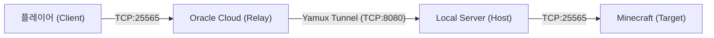

# Tunnel Relay

> 마인크래프트 서버를 위한 맞춤형 역방향 터널 릴레이

Tunnel Relay는 공인 IPv4 주소가 없는 로컬 마인크래프트 서버를 노출하기 위해 Oracle Cloud E2 Micro 인스턴스를 릴레이 서버로 사용하는 역방향 터널링 솔루션입니다.

## 기능

- **역방향 터널링**: 포트 포워딩이 필요 없으며 호스트가 릴레이로 아웃바운드 연결
- **멀티플렉싱**: 단일 TCP 연결에서 Yamux를 사용한 효율적인 멀티플렉싱
- **실시간 모니터링**: 로그와 통계를 보여주는 TUI 기반 모니터
- **데몬 모드**: 서버가 백그라운드 데몬으로 실행되며 시작/중지/상태 명령어 지원
- **REST API**: 모니터링 및 로그 스트리밍을 위한 HTTP API
- **크로스 플랫폼**: Linux, macOS, Windows 지원

## 아키텍처

### 네트워크 흐름



1. **릴레이 서버**: Oracle Cloud VPS에서 실행
   - 포트 `8080`: 호스트 클라이언트 연결용 제어 채널
   - 포트 `25565`: 플레이어 게임 접속용

2. **호스트 (클라이언트)**: 로컬 머신의 마인크래프트 서버에서 실행
   - 릴레이의 `8080` 포트로 아웃바운드 TCP 연결 시작
   - 로컬 `localhost:25565`로 트래픽 프록시

3. **Yamux 멀티플렉싱**:
   - 릴레이와 호스트 간 단일 TCP 연결
   - 각 플레이어 연결에 대한 가상 스트림 생성
   - 연결 오버헤드 감소

## 빠른 시작

### 사전 요구사항

- Go 1.21 이상
- Oracle Cloud 계정 (또는 공인 IP가 있는 VPS)

### 빌드

```bash
git clone <repository-url>
cd tunnel
make
```

`bin/tunnel-server`와 `bin/tunnel-client`가 생성됩니다.

### Oracle Cloud 설정

1. **E2 Micro 인스턴스 생성**:
   - Ubuntu 22.04 또는 Oracle Linux
   - 공인 IPv4 주소 활성화

2. **보안 목록 구성**:
   - TCP 포트 `8080`과 `25565`에 대한 인그레스 규칙 추가

3. **방화벽 구성**:
   ```bash
   # Ubuntu/Debian
   sudo ufw allow 8080/tcp
   sudo ufw allow 25565/tcp

   # Oracle Linux
   sudo firewall-cmd --permanent --add-port=8080/tcp
   sudo firewall-cmd --permanent --add-port=25565/tcp
   sudo firewall-cmd --reload
   ```

### 사용법

#### 서버 (릴레이)

```bash
# 백그라운드 데몬으로 서버 시작
./bin/tunnel-server start

# 상태 확인
./bin/tunnel-server status

# TUI 모니터 열기
./bin/tunnel-server monitor

# 서버 중지
./bin/tunnel-server stop
```

#### 클라이언트 (호스트)

```bash
# 클라이언트 실행 (구성을 위한 TUI 열림)
./bin/tunnel-client
```

클라이언트 TUI에서 다음을 입력하라는 메시지가 표시됩니다:
- 릴레이 서버 주소 (예: `your-oci-instance:8080`)
- 로컬 마인크래프트 서버 주소 (예: `localhost:25565`)
- 표시용 공용 게임 포트 (예: `25565`)

## 구성

### 서버 옵션

| 옵션 | 기본값 | 설명 |
|------|--------|------|
| `--control-port` | 8080 | 호스트 연결용 포트 |
| `--game-port` | 25565 | 플레이어 연결용 포트 |
| `--api-port` | 6060 | HTTP API 포트 |

### 파일

- `~/.tunnel-relay.pid`: 실행 중인 데몬의 프로세스 ID
- `~/.tunnel-relay.log`: 서버 로그 출력

## API 참조

서버는 모니터링 및 로그 스트리밍을 위한 REST API를 노출합니다.

### 엔드포인트

#### GET `/status`

서버 상태 정보를 반환합니다.

**응답:**
```json
{
  "public_ip": "203.0.113.1",
  "control_port": 8080,
  "game_port": 25565,
  "active_players": 2,
  "bytes_transferred": 15432,
  "tunnel_connected": true,
  "uptime_seconds": 3600
}
```

#### GET `/logs`

Server-Sent Events (SSE)로 실시간 로그 스트림을 제공합니다.

**예시:**
```bash
curl -N http://localhost:6060/logs
```

**이벤트 형식:**
```
data: [Control] Connection from 192.168.1.100:54321

data: [Game] Player connected: 203.0.113.50:25565

data: [Game] Player disconnected: 203.0.113.50:25565
```

## 개발

### 프로젝트 구조

```
tunnel/
├── cmd/
│   ├── client/          # TUI가 있는 호스트 클라이언트
│   └── server/          # 데몬 지원이 있는 릴레이 서버
├── pkg/
│   ├── daemon/          # 데몬 관리 유틸리티
│   ├── relay/           # 코어 릴레이 로직 및 API
│   └── tunnel/          # 향후 사용을 위해 예약됨
├── bin/                 # 생성된 바이너리
├── go.mod
├── go.sum
├── Makefile
└── README.md
```

### 의존성

- [`hashicorp/yamux`](https://github.com/hashicorp/yamux): 멀티플렉싱 라이브러리
- [`charmbracelet/bubbletea`](https://github.com/charmbracelet/bubbletea): TUI 프레임워크
- [`charmbracelet/lipgloss`](https://github.com/charmbracelet/lipgloss): 터미널 스타일링

### 빌드

```bash
# 클라이언트와 서버 모두 빌드
make

# 클라이언트만 빌드
make client

# 서버만 빌드
make server

# 빌드 아티팩트 정리
make clean

# 클라이언트 실행 (먼저 빌드)
make run-client

# 서버 실행 (먼저 빌드)
make run-server
```

### 테스트

```bash
# 모든 테스트 실행
go test ./...

# 커버리지와 함께 테스트
go test -cover ./...
```

## 문제 해결

### 일반적인 문제

#### 서버가 시작되지 않음
- 포트 8080, 25565, 6060이 사용 가능한지 확인
- 방화벽이 인바운드 연결을 허용하는지 확인
- `~/.tunnel-relay.log`에서 오류 메시지 확인

#### 클라이언트가 릴레이에 연결할 수 없음
- 릴레이 서버 주소와 포트 확인
- 릴레이 서버가 실행 중인지 확인 (`tunnel-server status`)
- 포트 8080으로의 아웃바운드 연결이 허용되는지 확인

#### 플레이어가 연결할 수 없음
- 릴레이의 공용 IP와 포트 25565가 접근 가능한지 확인
- 호스트 클라이언트가 릴레이에 연결되어 있는지 확인
- 지정된 포트에서 로컬 마인크래프트 서버가 실행 중인지 확인

#### 높은 지연 시간 또는 연결 끊김
- 호스트와 릴레이 간 네트워크 연결 확인
- Yamux 관련 오류에 대한 서버 로그 모니터링
- 지리적으로 가까운 릴레이 서버 사용 고려

### 로그 파일

- 서버 로그: `~/.tunnel-relay.log`
- 실시간 로그 보기: `tunnel-server monitor`
- 프로그래매틱 로그 액세스: `/logs` API 엔드포인트

### 디버그 모드

추가 디버깅을 위해 서버를 포그라운드에서 실행:

```bash
# 데몬이 아닌 직접 서버 실행
./bin/tunnel-server --control-port=8080 --game-port=25565 --api-port=6060
```

## 문서

종합적인 문서는 [docs/](docs/) 디렉토리를 참조하세요:

- **[API 참조](docs/api.md)** - 완전한 REST API 문서
- **[개발 가이드](docs/development.md)** - 기여 및 개발 설정
- **[배포 가이드](docs/deployment.md)** - 프로덕션 배포 전략
- **[구성 참조](docs/configuration.md)** - 모든 구성 옵션
- **[문서 색인](docs/README.md)** - 완전한 문서 개요

## 변경 로그

버전 기록 및 마이그레이션 가이드는 [CHANGELOG.md](CHANGELOG.md)를 참조하세요.

## 감사의 말

- [Yamux](https://github.com/hashicorp/yamux) 멀티플렉싱
- [Bubbletea](https://github.com/charmbracelet/bubbletea) TUI 프레임워크
- Oracle Cloud 인프라 제공